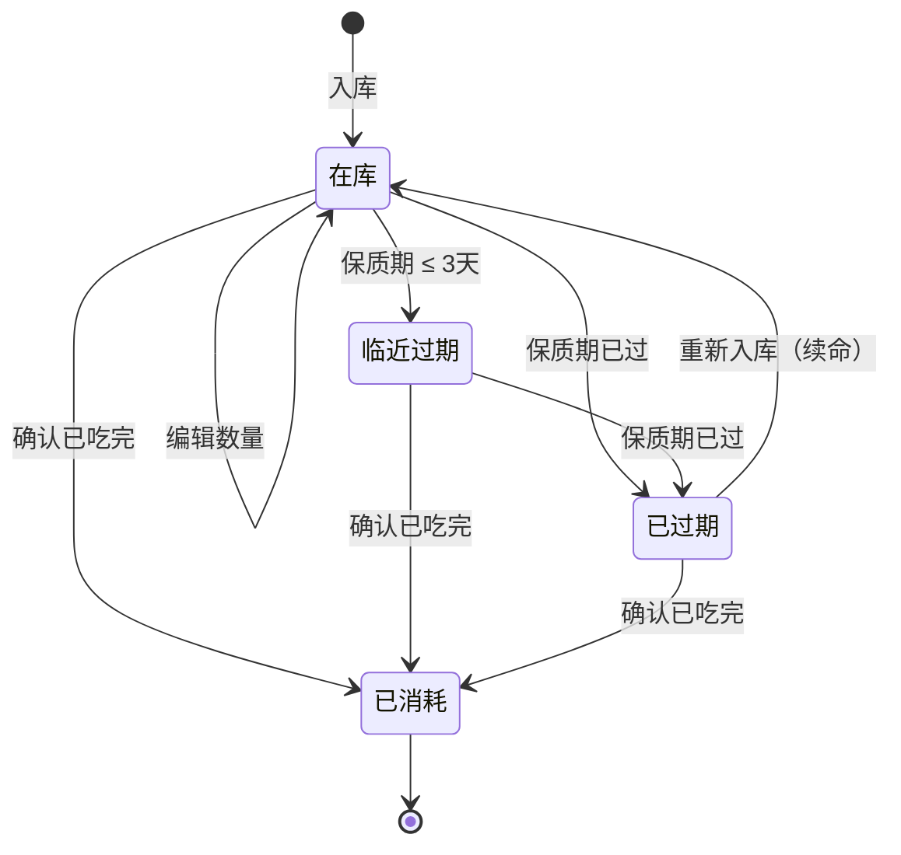
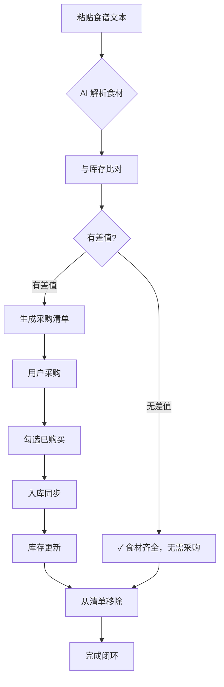

# 产品需求文档（PRD）：AI 驱动型智能厨房管理系统

**文档版本**：v1.0
**撰写日期**：2026-03-22
**产品负责人**：贺美玲
**状态**：初稿待评审

---

## 1. 项目背景

### 1.1 需求简介

上班族缺乏系统化的食材管理手段，冰箱里的菜放到过期忘记吃、采购全凭脑子记、食谱想做但不知道缺什么的问题普遍存在。本产品定位为"上班族的食材 ERP"，通过 AI 将采购入库、库存可视化、食谱解析、差值生成采购清单、消耗出库的全链路串联起来，实现"买什么-有什么-缺什么"的闭环。

### 1.2 业务诉求

- 不想每次做饭前还要盘点冰箱——系统自动知道有什么、缺什么
- 不想手动一条条录食材入库——说一句话就能完成
- 不想自己比对食谱和库存——系统自动算出要买什么
- 不想食材放到坏掉——快过期前主动提醒

---

## 2. 业务流程简述

用户完整的核心路径如下：

```
采购回家
    ↓
自然语言录入（如"买了3个番茄和一斤排骨"）
    ↓
AI 解析 → 入库 → 库存更新
    ↓
做饭前粘贴食谱文本
    ↓
AI 提取食材 → 与库存比对 → 生成差值采购清单
    ↓
点击"已购买" → 采购清单同步入库 → 库存更新
    ↓
食材消耗后手动/语音出库
    ↓
系统持续追踪保质期
```

---

## 3. 详细功能说明

### 3.1 食材库存看板

- **位置**：首页，默认视图
- **目标**：直观展示当前所有食材现状，支持快速浏览和状态识别

#### 3.1.1 布局规则

- 采用网格/卡片布局，每个食材一张卡片
- 卡片排列顺序：按保质期由近到远排序（即快过期食材排在最前面）
- 筛选维度支持：按分类筛选（全部/蔬菜/肉类/调料/干货/其他）
- 搜索框：支持按食材名称模糊搜索，实时过滤

#### 3.1.2 食材卡片信息

每张卡片包含以下字段：

| 字段 | 说明 | 显示规则 |
|------|------|---------|
| 名称 | 食材名称 | 必显 |
| 分类 | 蔬菜/肉类/调料/干货/其他 | 必显，以标签形式展示 |
| 剩余量 | 数量 + 单位 | 必显 |
| 保质期 | 过期日期 | 必显 |
| 状态 | 在库/已消耗 | 库存 > 0 为在库 |

#### 3.1.3 卡片视觉规则

- **正常食材**：白色/浅色卡片，常规字体
- **临近过期（3 天内）**：卡片边框变为橙色，名称旁显示橙色警告图标
- **已过期**：卡片变灰，名称上划线，显示红色"已过期"标签
- **已消耗**：不展示在默认视图，可在筛选中选择"已消耗"查看

#### 3.1.4 无数据状态

- 库存为空时，显示空状态插画 + 文字："冰箱还是空的，试试在下面输入'买了xxx'开始添加食材吧"
- 不显示骨架屏，直接展示空状态

#### 3.1.5 卡片交互

- 点击卡片：展开详情浮层，显示完整信息，支持编辑或确认消耗
- 长按卡片（移动端）：弹出快捷操作菜单（编辑/确认已吃完/删除）
- 右滑卡片（移动端）：快速标记"已吃完"

---

### 3.2 AI 智能交互中心

- **位置**：首页顶部，占据视觉焦点区域
- **目标**：通过自然语言完成食材录入和食谱比对，无需手动操作

#### 3.2.1 入库模式

**触发方式**：在输入框输入自然语言，点击发送或直接回车

**输入示例**：

- "买了3个番茄和一斤排骨"
- "冰箱里进了半斤牛肉、两个土豆、半根黄瓜"

**解析规则**：

- AI 自动识别：食材名称、数量、单位、分类
- 识别后显示确认卡片，格式如下：

```
检测到以下食材：
• 番茄 × 3（个）
• 排骨 × 1（斤）- 分类：肉类
• 牛肉 × 0.5（斤）- 分类：肉类
• 土豆 × 2（个）- 分类：蔬菜）
• 黄瓜 × 0.5（根）- 分类：蔬菜）

[确认入库]  [编辑]  [取消]
```

- 用户点击"确认入库"后，数据写入数据库，列表实时刷新
- 用户点击"编辑"，进入**编辑浮层**（见 3.2.1.1）
- 用户点击"取消"，确认卡片收起，输入框内容清空

**异常处理**：

- AI 无法识别食材名：输入框下方红色提示"无法识别'xxx'，请尝试换一种说法"
- 食材名疑似但不确定：显示黄色提示"是否要把'xxx'识别为食材？"，等待用户确认
- 网络异常：顶部弹出红色提示"网络异常，入库失败，请重试"，输入内容保留

#### 3.2.1.1 编辑浮层（编辑状态）

**触发时机**：用户点击确认卡片上的"编辑"按钮

**浮层规则**：

- 出现位置：确认卡片区域，卡片被替换为编辑浮层
- 点击遮罩层不关闭编辑浮层（防止误触）
- 仅右上角 X 按钮和"取消"按钮可关闭浮层

**编辑表单布局**：

- 每一种食材占一行，垂直排列
- 每行包含四个可编辑字段，从左到右依次为：名称 / 数量 / 单位 / 分类
- 右侧显示删除按钮（红色 X），可删除该行
- 底部显示"+ 添加食材"按钮，支持手动新增一行

**字段编辑规则**：

| 字段 | 输入类型 | 编辑限制 | 校验规则 |
|------|---------|---------|---------|
| 名称 | 文本输入框 | 最少 1 字符，最多 20 字符 | 失焦时校验；为空时显示红色边框 + 提示"食材名称不能为空" |
| 数量 | 数字输入框 | 支持小数，正数 | 失焦时校验；小于等于 0 时清空并提示"数量必须大于 0" |
| 单位 | 下拉选择框 | 选项：个/斤/克/公斤/两/升/毫升 | 默认"个" |
| 分类 | 下拉选择框 | 选项：蔬菜/肉类/调料/干货/其他 | 默认"其他" |

**行级操作**：

- 删除：点击红色 X，该行立即消失，无需二次确认
- 新增：点击"+ 添加食材"，在列表底部新增一行空行，光标自动聚焦到名称字段
- 每行食材独立校验，互不影响

**底部操作栏**：

- 左侧："取消"按钮（关闭浮层，不保存）
- 右侧："确认入库"按钮

**确认入库校验**：

- 点击后，逐行校验：
  - 任一必填字段为空或校验不通过：定位到第一个错误行，红色高亮该行，显示错误提示，阻止提交
  - 所有校验通过：关闭浮层，写入数据库，列表实时刷新
- 写入成功后，输入框内容清空

**编辑状态下的空行处理**：

- 用户在新增的空行上未填写任何内容就点击"确认入库"：自动忽略并删除该空行，不影响其他有效食材入库

**编辑 → 取消的交互**：

- 点击"取消"：关闭浮层，确认卡片恢复原样，用户输入的编辑内容全部放弃，不保留

#### 3.2.2 食谱模式

**触发方式**：点击输入框右侧"导入食谱"按钮

**交互流程**：

1. 弹出模态框，居中显示
2. 模态框内：大文本框，支持粘贴长段食谱文字（无字符限制）
3. 模态框底部："开始分析"按钮
4. 点击"开始分析"后：
   - 按钮变为加载状态，显示"AI 正在分析中..."
   - 文本框禁用
   - 分析完成后，跳转至"比对详情页"（见 3.2.3）
5. 粘贴为空时，"开始分析"按钮置灰不可点击

**模态框规则**：

- 点击遮罩层不关闭（防止误触丢失输入内容）
- 仅有关闭按钮（右上角 X）和"取消"按钮可关闭
- 关闭时清空输入内容

#### 3.2.3 比对详情页

**进入方式**：从食谱模式分析完成后自动跳转

**布局**：左右分栏

- 左栏：原始食谱文本（只读，支持滚动）
- 右栏：AI 解析后的"食材需求清单"

**食材需求清单展示规则**：

| 食材 | 需求 | 库存现状 | 差值 |
|------|------|---------|------|
| 番茄 | 3 个 | 1 个 | 2 个（需采购）|
| 鸡蛋 | 2 个 | 0 个 | 2 个（需采购）|
| 牛肉 | 200g | 150g | 50g（需采购）|

- 库存中已有的食材：显示绿色背景行
- 库存中不足或没有的食材：显示橙色背景行，差值高亮

**底部操作栏**：

- "一键复制清单"：将差值食材复制到剪贴板（格式：番茄×2、鸡蛋×2...）
- "开始采购"：将差值清单加入"动态采购清单"，跳转回首页并显示采购清单浮层
- "重新分析"：返回食谱输入模态框

#### 3.2.4 库存快过期查询

**触发方式**：在 AI 输入框输入"冰箱里还有什么快坏了"等类似语义

**输出格式**：卡片列表，显示快过期食材

```
以下食材将在 3 天内过期：
• 番茄 × 2 个（还剩 1 天）
• 牛肉 × 0.5 斤（还剩 2 天）

[去处理]  [忽略]
```

- 点击"去处理"：跳转至库存看板并自动筛选"临近过期"
- 点击"忽略"：关闭提示，该食材不再主动提醒（单次有效）

---

### 3.3 动态采购清单

- **位置**：首页右下角悬浮按钮，点击展开侧边栏；或从比对详情页底部进入
- **目标**：管理当前采购需求，支持一键闭环入库

#### 3.3.1 清单展示

- 每行格式：食材名称 + 差值数量 + 单位 + 勾选框
- 未勾选：默认状态
- 已勾选：表示已购买，点击后自动同步入库

#### 3.3.2 一键采购闭环

**交互流程**：

1. 用户勾选已购买的食材（或点击单项右侧"已买"）
2. 系统弹出二次确认："确认以下食材已购买入库？"
3. 用户确认后：
   - 该食材从采购清单中移除
   - 库存中对应食材数量增加
   - 页面实时刷新
4. 若采购数量与差值不完全匹配（用户实际买了更多/更少），支持在确认框内手动修改数量后再入库

#### 3.3.3 异常处理

- 采购清单为空时：显示空状态"暂无采购计划，可以在食谱页面添加"
- 网络异常导致同步入库失败：保留清单内容，顶部显示红色提示"入库失败，请重试"

---

### 3.4 食材消耗出库

- **位置**：食材卡片详情浮层；或首页卡片右滑快捷操作
- **目标**：记录食材已被使用/吃掉，自动扣减库存

#### 3.4.1 消耗操作

- 点击"确认已吃完"：剩余量归零，状态变为"已消耗"，从默认看板视图移除
- 点击"用掉一半"：剩余量减半，保留在库
- 支持自定义输入消耗量（如"用掉了 200g 牛肉"）

#### 3.4.2 异常处理

- 消耗后剩余量小于等于零：直接归零，状态更新为"已消耗"
- 无权限操作（多人共用场景）：提示"操作失败，请重试"

---

### 3.5 保质期预警系统

- **位置**：独立标签页或首页顶部横幅（当有预警时）
- **目标**：主动提醒用户即将过期食材，减少浪费

#### 3.5.1 预警规则

| 预警等级 | 触发条件 | 展示形式 |
|---------|---------|---------|
| 红色预警 | 1 天内过期 | 首页顶部红色横幅 + 食材卡片边框变红 |
| 橙色预警 | 3 天内过期 | 首页顶部橙色横幅 + 食材卡片边框变橙 |
| 黄色提醒 | 7 天内过期 | 仅在保质期标签页显示，不触发横幅 |

#### 3.5.2 横幅规则

- 横幅置顶，显示预警食材数量："冰箱里有 3 样食材即将过期"
- 横幅右侧"查看"按钮，点击跳转至保质期标签页
- 横幅可左滑关闭（单次有效），不重复提醒
- 每日早 9 点推送一次保质期提醒通知（若有待处理预警）

---

## 4. 流程与状态图表

### 4.1 食材生命周期状态机



### 4.2 食谱采购闭环流程图



---

## 5. 技术架构

### 5.1 技术选型

| 层级 | 技术选型 | 说明 |
|------|---------|------|
| 前端框架 | Next.js 14+（App Router）| 支持服务端渲染，API 路由天然对齐 |
| UI 组件库 | Shadcn UI + Tailwind CSS + Lucide Icons | 极简高级感，深色模式友好 |
| 数据库 | Supabase（PostgreSQL）| 支持实时订阅，方便 OpenClaw 调用 API |
| AI 解析 | DeepSeek-V3 / GPT-4o-mini | 负责自然语言结构化解析 |

### 5.2 部署目标

- 优先 Web 原型版本，可部署至 Vercel
- 后续如需多端，可扩展为 PWA

### 5.3 AI 解析策略

**入库解析 Prompt（系统级指令）**：

```
你是一个食材管理专家。请将用户输入的自然语言转换为 JSON 格式数组。

识别规则：
- 数量：阿拉伯数字或中文数字，转换为小数（如"半斤"→0.5）
- 单位：个/斤/克/公斤/两，保留原样
- 分类：根据食材名称推断分类（蔬菜/肉类/调料/干货/其他）

输入："买了3个番茄和一斤排骨"
输出：[{"name":"番茄","quantity":3,"unit":"个","category":"蔬菜"},{"name":"排骨","quantity":1,"unit":"斤","category":"肉类"}]
```

**食谱解析 Prompt（系统级指令）**：

```
你是一个食谱分析专家。请从以下食谱文本中提取所有食材及其预估用量。

提取规则：
- 列出所有明确提及的食材
- 用量无法精确时，根据经验估算合理默认值
- 输出 JSON 数组

输入：[用户粘贴的食谱文本]
输出：[{"name":"食材名","quantity":数字,"unit":"单位","category":"分类"},...]
```

---

## 6. 数据库结构

### 6.1 食材库存表

```sql
CREATE TABLE inventory (
  id UUID PRIMARY KEY DEFAULT uuid_generate_v4(),
  name TEXT NOT NULL,
  category TEXT CHECK (category IN ('蔬菜', '肉类', '调料', '干货', '其他')),
  quantity DECIMAL NOT NULL DEFAULT 0,
  unit TEXT DEFAULT '个',
  expiry_date DATE,
  status TEXT DEFAULT 'in-stock' CHECK (status IN ('in-stock', 'consumed')),
  created_at TIMESTAMP WITH TIME ZONE DEFAULT NOW(),
  updated_at TIMESTAMP WITH TIME ZONE DEFAULT NOW()
);

-- 索引：按名称搜索、按保质期排序
CREATE INDEX idx_inventory_name ON inventory(name);
CREATE INDEX idx_inventory_expiry ON inventory(expiry_date);
CREATE INDEX idx_inventory_status ON inventory(status);
```

### 6.2 食谱记录表

```sql
CREATE TABLE recipes (
  id UUID PRIMARY KEY DEFAULT uuid_generate_v4(),
  title TEXT,
  ingredients JSONB NOT NULL,
  original_text TEXT,
  created_at TIMESTAMP WITH TIME ZONE DEFAULT NOW()
);
```

### 6.3 采购清单表

```sql
CREATE TABLE shopping_list (
  id UUID PRIMARY KEY DEFAULT uuid_generate_v4(),
  item_name TEXT NOT NULL,
  quantity DECIMAL NOT NULL,
  unit TEXT DEFAULT '个',
  is_purchased BOOLEAN DEFAULT FALSE,
  created_at TIMESTAMP WITH TIME ZONE DEFAULT NOW()
);
```

---

## 7. API 接口

### 7.1 库存相关

| 接口 | 方法 | 说明 |
|------|------|------|
| `/api/inventory` | GET | 获取当前所有在库食材 |
| `/api/inventory/add` | POST | 传入自然语言文本，AI 解析后入库 |
| `/api/inventory/update/:id` | PATCH | 更新指定食材的数量或状态 |
| `/api/inventory/consume/:id` | POST | 消耗指定食材，扣减数量 |

### 7.2 食谱相关

| 接口 | 方法 | 说明 |
|------|------|------|
| `/api/recipe/analyze` | POST | 传入食谱文本，返回食材需求列表 |
| `/api/recipe/gap` | POST | 传入食谱 ID，返回与库存的差值清单 |

### 7.3 采购清单相关

| 接口 | 方法 | 说明 |
|------|------|------|
| `/api/shopping-list` | GET | 获取当前采购清单 |
| `/api/shopping-list/sync/:id` | POST | 将清单项标记为已购买并同步入库 |

---

## 8. 页面结构

### 8.1 页面清单

| 页面 | 路由 | 说明 |
|------|------|------|
| 首页/库存看板 | `/` | 默认落地页，展示库存卡片 + AI 输入框 |
| 食谱分析页 | `/recipe` | 食谱粘贴入口 |
| 比对详情页 | `/recipe/gap` | 展示食谱与库存比对结果 |
| 采购清单页 | `/shopping` | 动态采购清单侧边栏 |
| 保质期预警页 | `/expiry` | 按过期时间排序的预警视图 |

### 8.2 首页布局

```
┌─────────────────────────────────────┐
│  AI 输入框 [说一句话录入食材]  [📖] │  ← AI 交互中心
├─────────────────────────────────────┤
│  🔍 搜索  [全部][蔬菜][肉类][调料]  │  ← 分类筛选
├─────────────────────────────────────┤
│ ┌─────┐  ┌─────┐  ┌─────┐  ┌─────┐ │
│ │番茄 │  │鸡蛋 │  │牛肉 │  │土豆 │ │  ← 食材卡片网格
│ │3个  │  │2个  │  │0.5斤│  │2个  │ │
│ │⚠️1天│  │5天  │  │3天  │  │7天  │ │
│ └─────┘  └─────┘  └─────┘  └─────┘ │
│                                     │
│                           [🛒 3]   │  ← 采购清单悬浮按钮
└─────────────────────────────────────┘
```

---

## 9. OpenClaw 接入预留

本系统的 API 端点为 OpenClaw Agent 预留了以下调用能力：

- Agent 可通过 `POST /api/inventory/add` 自动录入对话中提及的采购信息
- Agent 可通过 `GET /api/inventory` 查询当前库存后回答"冰箱里有什么"
- Agent 可通过 `POST /api/recipe/analyze` 分析食谱并生成采购建议
- 后续可扩展为：Agent 主动推送"冰箱里有 3 样食材快过期了"

---

**文档结束**
